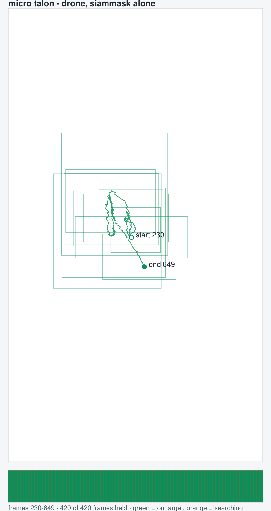
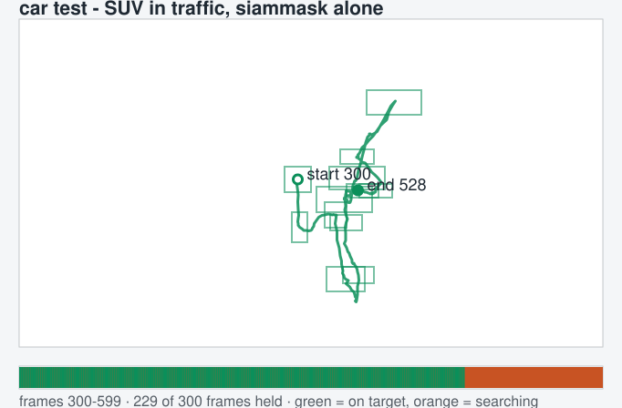

# Skytrack — SiamMask, for phone clips

Pick one target in a video, and SiamMask follows it — on a CPU, no GPU, no
detector. It segments the target as it goes, so what you see is its real outline,
not the box you drew.

```bash
python siamtrack.py "micro talon.mov"
python siamtrack.py car_test.mp4 --output tracked.mp4 --csv telemetry.csv
```

Scrub to a frame where the target is clearly visible, press ENTER, drag a box
around it, press ENTER again. Press **R** at any time to draw the box again, **Q**
or **Esc** to quit.

## The two test runs

The real footage, playing inside an SVG, with SiamMask's mask over the target:

<p align="center">
  
  
</p>

And the same runs as a drawing — the path the target's centre took, a box along it
every so often, and a timeline underneath, green where the target was held and
orange where it was not:

<p align="center">
  
  
</p>

## What runs, and what does not

SiamMask is a siamese network with a ResNet-50 backbone. It keeps a template of
the target from the moment you picked it, searches a window around where the
target was last seen, and returns the best match in that window together with a
mask of the object. That is the whole pipeline here.

There is **no detector**, no identities, no memory of the target's appearance —
which is the point of this repository: what SiamMask on its own is worth on real
phone footage, measured. The detector-based pipeline is a separate repository,
[Skytrack_yolo26_mobile_clip_bytrack](https://github.com/aymane00o/Skytrack_yolo26_mobile_clip_bytrack),
and the comparison is at the bottom of this README.

A tracker with no detector cannot rediscover a target it has lost: nothing in it
knows what a car or an aircraft is, only what this one looked like in the window
it was last seen. So when the target leaves, this run says so and stops following
rather than drifting onto scenery. `--reacquire` turns on a contrast-based search
for a target against sky, which is the only recovery available without a detector.

## Measured

300 frames per run, headless, one run at a time, each starting on a frame where
the target is in clear view:

| clip | follower | speed | frames held | mask |
| --- | --- | --- | --- | --- |
| micro talon | **SiamMask, 255 px window** | 7.9 fps | 300/300 (100%) | yes |
| micro talon | SiamMask, 191 px window | 10.7 fps | 300/300 (100%) | yes |
| micro talon | CSRT, for comparison | 22.2 fps | 300/300 (100%) | no |
| car test | **SiamMask, 255 px window** | 13.2 fps | 229/300 (76%) | yes |
| car test | SiamMask, 191 px window | 19.5 fps | 228/300 (76%) | yes |
| car test | CSRT, for comparison | 60.1 fps | 245/300 (82%) | no |

Read it honestly: **on these two stretches SiamMask is 3–5× slower than CSRT and
holds the target no better.** What it gives you instead is the outline — the box
stays wrapped around the car as it turns, where a correlation tracker keeps
roughly the rectangle it was handed. The smaller 191 px search window is a third
faster and, on this footage, tracked identically.

The drone stretch starts after takeoff, in the air. Measuring from the mat
instead would say more about the takeoff than about the follower: both trackers
lose the aircraft as it leaves the ground, and a run that spends most of its
frames having lost the target also reports a flattering speed, because a lost
tracker does no work.

Both runs end where the target leaves the frame, and the timeline in the drawings
above shows that plainly.

Reproduce with `python bench_followers.py --frames 300`, or point `CLIPS` in that
file at your own footage. `held` counts frames with a box on something; whether
that box is on the right object is checked by eye from the contact sheets the
benchmark writes — on the car clip all three followers stay on the same car.

## Install

```bash
pip install -r requirements.txt
```

SiamMask's code and weights are not in this repository:

```bash
git clone https://github.com/foolwood/SiamMask third_party/SiamMask
```

then put `SiamMask_DAVIS.pth` (from that project's releases) next to
`siamtrack.py`. Without them, `--follower csrt` still runs.

## Options worth knowing

| Flag | Default | For |
| --- | --- | --- |
| `--follower siammask\|csrt` | `siammask` | what follows the target |
| `--search` | 255 | the window SiamMask searches each frame; 191 is a third faster |
| `--work-height` | 1080 | work on frames this tall; smaller is faster and loses small targets |
| `--reacquire` | off | contrast-based search for a lost target against sky |
| `--bbox X,Y,W,H --start-frame N` | — | skip the picker and repeat a run exactly |
| `--repick FRAME:X,Y,W,H` | — | make the R-key correction part of the command |
| `--no-show` | off | write `--output`/`--csv` with no window |
| `--no-pace` | off | run as fast as it computes instead of at the video's speed |

## Which of the two repositories to use

| | this one: SiamMask alone | [YOLO26 + ByteTrack](https://github.com/aymane00o/Skytrack_yolo26_mobile_clip_bytrack) |
| --- | --- | --- |
| needs | SiamMask code + 105 MB of weights | `ultralytics`, weights downloaded on first use |
| knows what the target is | no — only what it looked like when picked | yes — car, truck, aircraft, bird |
| target leaves and comes back | gone, unless you press R | recognised and taken back |
| what you see | the target's outline, frame by frame | box, ID, speed, trail, prediction arrow |
| speed on these clips | 8–13 fps | 5–6 fps |
| best for | a close target you want cut out precisely | anything that has to survive being lost |

## Files

```
siamtrack.py       the pipeline: pick the target, then SiamMask follows it
siammask.py        loading SiamMask and running it as a tracker
track.py           the tracking loop, lock and drawing
tracker.py         the per-track bookkeeping the loop keeps
overlay.py         brackets, labels, trail, arrow, inset, mask
bench_followers.py the measurements in this README
make_figures.py    a run's telemetry drawn as an SVG
make_clip_svg.py   real frames of a run, animated, as an SVG
```

`bytetrack.py`, `reid.py` and `detector.py` are here because the shared tracking
loop imports them; this entry point never turns them on.
